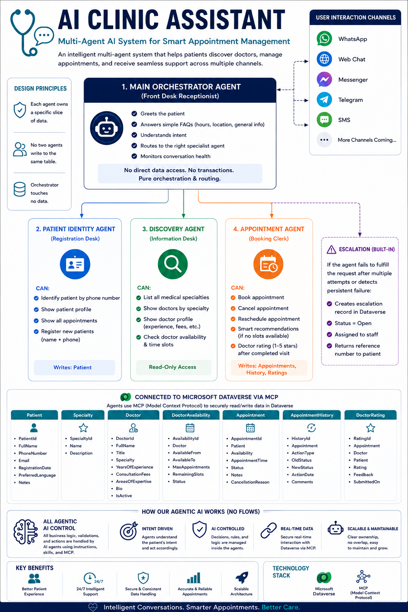

# 🏥 AI Clinic Assistant

> An Agentic AI-powered healthcare appointment management system built using **Microsoft Copilot Studio**, **Microsoft Dataverse**, and the latest **Agentic AI capabilities** in the Microsoft Power Platform ecosystem.

---

## 📌 Project Overview

The **AI Clinic Assistant** is an experimental multi-agent healthcare solution developed to explore the new **Agentic AI features in Microsoft Copilot Studio**.

The system simulates a real-world clinic assistant capable of helping patients:

* Register and identify themselves.
* Discover doctors and medical specialties.
* Search doctor availability.
* Book, cancel, and reschedule appointments.
* Receive smart recommendations when appointments are unavailable.
* Rate doctors after consultations.
* Escalate unresolved issues.

The entire business logic is implemented through **Agent Instructions, Skills, and Dataverse interactions via MCP (Model Context Protocol)** without relying on traditional workflow automation.

---

## 🚀 Key Features

### 👤 Patient Management

* Patient identification using phone number.
* New patient registration.
* Patient profile retrieval.
* Retrieve patient appointment history.

### 🔎 Doctor Discovery

* Browse medical specialties.
* Search doctors by specialty.
* View doctor profiles and expertise.
* Check doctor availability and appointment slots.

### 📅 Appointment Management

* Book appointments.
* Cancel appointments.
* Reschedule appointments.
* Automatic appointment history tracking.

### ⭐ Smart Features

* AI-powered doctor recommendations.
* Doctor ratings and feedback.
* Escalation handling for failed requests.

---

# 🏗️ System Architecture

The system follows an **Agentic Multi-Agent Architecture**.



---

# 🤖 Agent Architecture

The solution consists of four specialized AI agents.

## 1️⃣ Main Orchestrator Agent

**Role:** Front Desk Receptionist

Responsibilities:

* Greets patients.
* Handles general FAQs.
* Understands user intent.
* Maintains conversation context.
* Routes requests to specialized agents.
* Monitors conversation health.

> The orchestrator never accesses Dataverse directly.

---

## 2️⃣ Patient Identity Agent

**Role:** Registration Desk

Responsibilities:

* Identify patients by phone number.
* Register new patients.
* Retrieve patient profile.
* Retrieve patient appointments.

### Writes To

* Patient

---

## 3️⃣ Discovery Agent

**Role:** Information Desk

Responsibilities:

* List medical specialties.
* Search doctors by specialty.
* Display doctor profiles.
* Check doctor availability.
* Display available appointment slots.

### Access Type

✅ Read-only

---

## 4️⃣ Appointment Agent

**Role:** Booking Clerk

Responsibilities:

* Book appointments.
* Cancel appointments.
* Reschedule appointments.
* Create appointment history records.
* Generate smart recommendations.
* Handle ratings and feedback.
* Create escalation requests when required.

### Writes To

* Appointment
* AppointmentHistory
* DoctorRating
* EscalationRequest

---

# 🔄 End-to-End Booking Flow

```text
Patient requests appointment
        ↓
Main Orchestrator
        ↓
Patient Identity Agent
(Identify/Register Patient)
        ↓
Discovery Agent
(Search Specialty → Doctor → Slot)
        ↓
Appointment Agent
(Create Appointment)
        ↓
Dataverse Update
        ↓
Confirmation Returned
```

---

# 🗄️ Dataverse Data Model

The solution uses **Microsoft Dataverse** as the single source of truth.

## Core Tables

| Table              | Purpose                            |
| ------------------ | ---------------------------------- |
| Patient            | Stores patient information         |
| Specialty          | Stores clinic specialties          |
| Doctor             | Stores doctor information          |
| DoctorAvailability | Stores available appointment slots |
| Appointment        | Stores appointments                |
| AppointmentHistory | Stores appointment audit records   |
| DoctorRating       | Stores patient feedback            |
| EscalationRequest  | Stores unresolved issues           |

---

# 🧠 Agentic Design Principles

The system follows the following principles:

* Each agent owns a specific business capability.
* No two agents write to the same business entities.
* The orchestrator performs routing only.
* Business logic lives inside agents.
* Dataverse acts as the single source of truth.
* Conversation context is shared across agents.

---

# 🛠️ Technology Stack

| Technology                   | Purpose                                      |
| ---------------------------- | -------------------------------------------- |
| Microsoft Copilot Studio     | Multi-agent orchestration                    |
| Microsoft Dataverse          | Data storage                                 |
| MCP (Model Context Protocol) | Real-time data interaction                   |
| Power Apps Plan Designer     | AI-assisted schema generation                |
| Model-Driven Apps            | Initial AI-generated application scaffolding |

---

# 📂 Repository Structure

```text
.
├── Appointment Agent/
├── Discovery Agent/
├── Main Orchestrator/
├── Patient Identity Agent/
├── Assets/
│   └── Architecture.png
├── Solution/
│   └── ClinicSolution.zip
└── README.md
```

---

# 📁 Agent Folders

Each agent folder contains:

* Agent instructions.
* Skills definitions.
* Knowledge configuration.
* Related prompts.
* Supporting documentation.

---

# 📦 Solution Package

The exported Power Platform solution can be found under:

```text
Solution/
```

This package contains:

* Dataverse tables.
* Relationships.
* Choices.
* Copilot Studio agents.
* Supporting solution components.

---

# 🎯 Learning Objectives

This project was developed as an exploration of:

* Microsoft Copilot Studio Agentic AI.
* Multi-agent system design.
* Agent orchestration patterns.
* Dataverse + MCP integration.
* AI-assisted application development using Power Platform.

---

# 🔮 Future Enhancements

* WhatsApp integration.
* Microsoft Teams integration.
* Real notification channels.
* Human handoff experiences.
* Analytics and Power BI dashboards.
* Autonomous appointment optimization.

---

# 🙏 Acknowledgements

Special thanks to:

* **TechLabs London**
* **Information Technology Institute (ITI)**
* All instructors and mentors involved in the Dynamics 365 learning journey.

Special appreciation to **Eng. Sameh Serag** for introducing and guiding us through the new Agentic AI capabilities in Microsoft Copilot Studio.

---

## 📜 License

This project is developed for educational and experimentation purposes.
